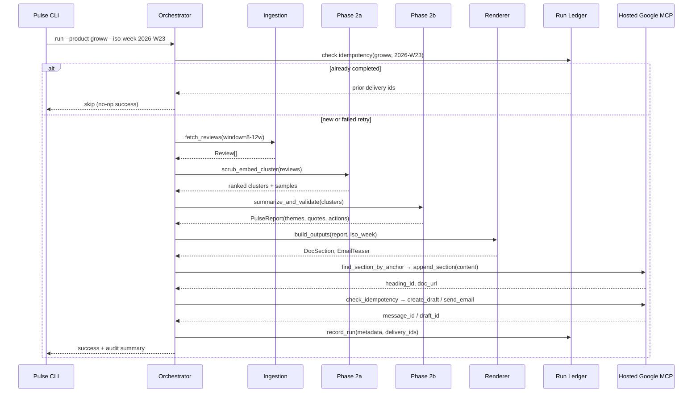
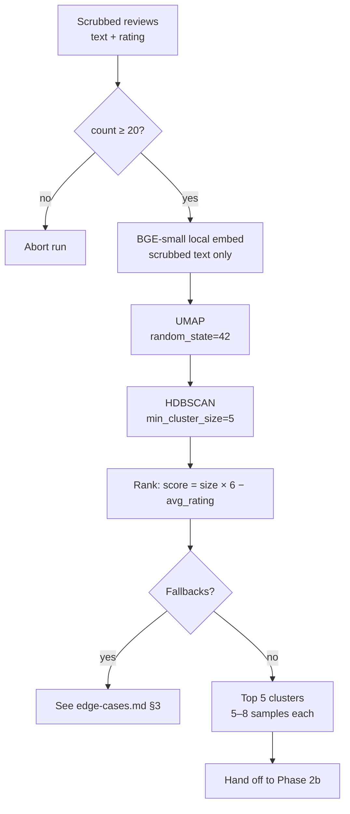

# Weekly Review Pulse — Architecture

This document describes the technical architecture for the **Groww Play Store review pulse**: components, data flows, MCP integration, idempotency, and operational concerns. It extends [problemStatement.md](./problemStatement.md) and is kept in sync with [implementation-plan.md](./implementation-plan.md).

---

## Table of Contents

1. [Goals and Constraints](#1-goals-and-constraints)
2. [System Context](#2-system-context)
3. [Logical Layers](#3-logical-layers)
4. [Repository Layout (Proposed)](#4-repository-layout-proposed)
5. [End-to-End Run Flow](#5-end-to-end-run-flow)
6. [Play Store Ingestion](#6-play-store-ingestion)
7. [Analysis Pipeline](#7-analysis-pipeline)
8. [Output Generation](#8-output-generation)
9. [MCP Server Architecture](#9-mcp-server-architecture)
10. [Run Ledger and Audit](#10-run-ledger-and-audit)
11. [Configuration](#11-configuration)
12. [CLI and Scheduling](#12-cli-and-scheduling)
13. [Security and Safety](#13-security-and-safety)
14. [Error Handling and Partial Failure](#14-error-handling-and-partial-failure)
15. [Observability](#15-observability)
16. [Environments](#16-environments)
17. [Testing Strategy](#17-testing-strategy)
18. [Future Expansion (Out of Scope for v1)](#18-future-expansion-out-of-scope-for-v1)
19. [Architecture Decision Summary](#19-architecture-decision-summary)
20. [Related Documents](#20-related-documents)

---

## 1. Goals and Constraints

| Goal | Architectural implication |
|------|-------------------------|
| Weekly insight report from Play Store reviews | Batch pipeline, not streaming |
| Google Doc as system of record | Append-only sections with stable anchors |
| Email as notification, not duplicate report | Teaser + deep link to Doc heading |
| MCP-only delivery to Google Workspace | Pulse agent never holds Google OAuth or calls REST directly |
| Idempotent weekly runs | Run ledger + deterministic section keys |
| Auditable history | Persist run metadata and delivery IDs |
| Safe LLM usage | PII scrubbing, quote validation, token/cost caps |

**Current scope:** Groww · Google Play Store · Google Docs MCP + Gmail MCP (both in this repo).

---

## 2. System Context

```
┌─────────────────────────────────────────────────────────────────────────────┐
│                              Stakeholders                                    │
│                    (Product · Support · Leadership)                          │
└─────────────────────────────────────────────────────────────────────────────┘
                                      ▲
                                      │ read Doc · receive email
                                      │
┌─────────────────────────────────────────────────────────────────────────────┐
│                            This Repository                                   │
│  ┌──────────────┐    ┌──────────────────────────────────────────────────┐   │
│  │ Pulse CLI /  │───▶│ Pulse Agent (MCP Host)                           │   │
│  │ Scheduler    │    │  ┌─────────────┐ ┌──────────────┐ ┌───────────┐  │   │
│  └──────────────┘    │  │ Play Store  │ │  Analysis    │ │ Report &  │  │   │
│                      │  │ Ingestion   │ │  Pipeline    │ │ Email     │  │   │
│                      │  └─────────────┘ └──────────────┘ │ Renderer  │  │   │
│                      │  ┌─────────────┐                   └───────────┘  │   │
│                      │  │ Run Ledger  │                                  │   │
│                      │  └─────────────┘                                  │   │
│                      └──────────┬────────────────────────────────────────┘   │
│                                 │ MCP (HTTP)                                 │
│                      ┌──────────▼──────────────────────────────────────┐        │
│                      │ Hosted Google MCP Server (Railway)              │        │
│                      │ https://web-production-bf583.up.railway.app/    │        │
│                      │  · Docs: find / append / get_document_url     │        │
│                      │  · Gmail: check_idempotency / draft / send    │        │
│                      └──────────┬──────────────────────────────────────┘        │
└─────────────────────────────────┼──────────────────────────────────────────────┘
                                  │
┌─────────────────────────────────┼─────────────────────────┼──────────────────┐
│                         External                             │                  │
│  ┌──────────────┐  ┌──────────▼──────────┐  ┌─────────────▼────────────┐  │
│  │ Google Play  │  │ Google Workspace    │  │ Groq API                   │  │
│  │ Store        │  │ APIs                │  │ llama-3.3-70b-versatile    │  │
│  └──────────────┘  │  · Weekly Review    │  └────────────────────────────┘  │
│                    │    Pulse — Groww    │  ┌────────────────────────────┐  │
│                    │  · Stakeholder        │  │ OpenAI Embeddings API      │  │
│                    │    Inboxes            │  │ BAAI/bge-small-en-v1.5     │  │
│                    └─────────────────────┘  └────────────────────────────┘  │
└─────────────────────────────────────────────────────────────────────────────┘
```

The **pulse agent** orchestrates ingestion, analysis, rendering, and delivery. It connects to the **hosted Google MCP Server** on Railway as an MCP client. Google OAuth credentials and API access are confined to that server — not the pulse repo.

---

## 3. Logical Layers

```
┌─────────────────────────────────────────────────────────────────────────────┐
│ Layer 4 — Delivery (MCP)                                                     │
│   Docs MCP Tools  ·  Gmail MCP Tools                                       │
├─────────────────────────────────────────────────────────────────────────────┤
│ Layer 3 — Output Generation                                                  │
│   Doc Section Builder  ·  Email Teaser Builder                             │
├─────────────────────────────────────────────────────────────────────────────┤
│ Layer 2b — LLM Summarization (Groq)                                          │
│   Groq Summarizer  ·  Quote Validator  ·  PulseReport assembly              │
├─────────────────────────────────────────────────────────────────────────────┤
│ Layer 2a — Preprocessing & Clustering                                        │
│   PII Scrubber  ·  Embedder  ·  UMAP + HDBSCAN  ·  Cluster ranking          │
├─────────────────────────────────────────────────────────────────────────────┤
│ Layer 1 — Data Retrieval                                                     │
│   Play Store Scraper  ·  Review Normalizer  ·  Cache                          │
└─────────────────────────────────────────────────────────────────────────────┘
```

| Layer | Phase | Responsibility | Must not |
|-------|-------|----------------|----------|
| **Data retrieval** | 1 | Fetch, normalize, cache Play Store reviews for Groww | Call Google Workspace APIs |
| **Preprocessing & clustering** | 2a | PII scrub, embed, cluster, rank, sample reviews | Call Groq or Google APIs |
| **LLM summarization** | 2b | Per-cluster Groq calls, quote validation, `PulseReport` | Write to Docs or Gmail |
| **Output generation** | 4 | Build plain-text Doc section and email HTML/text | Hold Google OAuth |
| **Delivery** | 5–6 | Call hosted MCP for Doc append + Gmail draft/send | Contain clustering/LLM logic |

---

## 4. Repository Layout (Proposed)

```
m3_6/
├── docs/
│   ├── problemStatement.md
│   ├── architecture.md
│   ├── implementation-plan.md
│   ├── edge-cases.md
│   └── phase1-run-notes.md
├── config/
│   ├── products/
│   │   └── groww.yaml          # Play Store app id, doc id, recipients
│   ├── pipeline.yaml           # window weeks, cluster params, LLM limits
│   └── mcp/
│       ├── servers.json          # MCP_SERVER_URL → Railway host
│       └── .env.example          # MCP_SERVER_URL (optional API key if required)
├── mcp-servers/                  # Legacy stubs only — delivery uses hosted MCP
│   ├── google-docs-mcp/          # README placeholder
│   └── gmail-mcp/                # README placeholder
├── pulse/
│   ├── cli.py                  # Entry: run, backfill, dry-run
│   ├── agent/
│   │   ├── orchestrator.py     # End-to-end run coordinator
│   │   └── mcp_client.py       # MCP host wiring
│   ├── ingestion/
│   │   ├── play_store.py       # Scraper + pagination
│   │   ├── normalizer.py       # ≥8 words, English, no emoji
│   │   ├── cache.py            # reviews_raw / reviews_normalized cache
│   │   ├── service.py          # run_ingestion orchestration
│   │   ├── sources.py          # ReviewSource protocol
│   │   └── models.py           # Review, RawReview, RunContext
│   ├── pipeline/
│   │   ├── scrubber.py         # PII redaction
│   │   ├── embeddings.py
│   │   ├── clustering.py       # UMAP + HDBSCAN
│   │   ├── summarizer.py       # LLM theme/quote/action generation
│   │   └── quote_validator.py  # Substring match against source reviews
│   ├── render/
│   │   ├── doc_section.py      # Plain-text section for append-only Docs MCP
│   │   └── email_teaser.py     # HTML + plain text teaser
│   └── ledger/
│       ├── store.py            # SQLite or JSON run ledger
│       └── models.py           # RunRecord, DeliveryRecord
├── data/                       # gitignored: cached reviews, run artifacts
└── tests/
```

This layout keeps the pulse pipeline and configuration in-repo while **delivery** delegates to the hosted Google MCP Server on Railway.

---

## 5. End-to-End Run Flow



### Run inputs

| Parameter | Description | Example |
|-----------|-------------|---------|
| `product` | Product slug | `groww` |
| `iso_week` | ISO 8601 week | `2026-W23` |
| `window_weeks` | Rolling review window | `10` (within 8–12 configurable range) |
| `dry_run` | Skip MCP writes | `false` |
| `email_mode` | `draft` or `send` | `draft` in staging |

### Run outputs (audit record)

```json
{
  "run_id": "groww-2026-W23-abc123",
  "product": "groww",
  "iso_week": "2026-W23",
  "review_count": 872,
  "window_weeks": 10,
  "started_at": "2026-06-08T03:30:00+05:30",
  "completed_at": "2026-06-08T03:42:11+05:30",
  "doc_delivery": {
    "document_id": "...",
    "section_anchor": "groww-2026-W23",
    "heading_id": "...",
    "url": "https://docs.google.com/document/d/...#heading=..."
  },
  "email_delivery": {
    "mode": "draft",
    "message_id": "...",
    "idempotency_key": "groww-2026-W23-email"
  },
  "status": "completed"
}
```

---

## 6. Play Store Ingestion

### Responsibilities

1. Resolve Groww's Play Store listing from product config (`play_store_app_id` or package name).
2. Scrape public reviews within the configured date window (8–12 weeks).
3. Paginate until window boundary or no more pages.
4. Normalize to a canonical `Review` model.

### Review models

**Raw cache** (`reviews_raw.json`) — full scrape payload per review:

| Field | Type | Notes |
|-------|------|-------|
| `text` | string | Raw review body |
| `rating` | int | 1–5 stars |
| `published_at` | datetime | UTC; used for window filtering |
| `review_id` | string | Optional; from Play Store scraper |
| `package_id` | string | e.g. `com.nextbillion.groww` |

**Normalized pipeline input** (`reviews_normalized.json`, `Review` in `models.py`) — what Phase 2a consumes:

| Field | Type | Notes |
|-------|------|-------|
| `text` | string | Review body passing quality filters |
| `rating` | int | 1–5 stars |

**Phase 1 normalization** (before cache write) — two rules:

1. **Drop** reviews with fewer than **8 words**.
2. **Drop** reviews that contain **emoji** or are **non-English** (Latin script + `langdetect` top language must be `en`).

**Observed Groww ratios** (10-week window, `2026-06-10` cache): ~**5,000** raw → **884** normalized (~**17.8%** kept). Metadata such as `review_id` and `published_at` remain in `reviews_raw.json` only—not in normalized output.

### Design decisions

- Cache raw and normalized pulls under `data/cache/{product}/{date}/` (`reviews_raw.json`, `reviews_normalized.json`, `manifest.json`) to avoid re-scraping on retries and to support audit (“what reviews were analyzed?”).
- Deduplicate raw reviews by hash of `(text, rating, published_at)` before normalization.
- Rate limiting with backoff; ingestion failures abort the run before any Doc/email write.
- No App Store adapter in v1; interface `ReviewSource` allows future sources without changing downstream pipeline.

---

## 7. Analysis Pipeline

The analysis pipeline splits into **Phase 2a** (preprocessing & clustering) and **Phase 2b** (Groq summarization & quote validation). See [implementation-plan.md](./implementation-plan.md#phase-2a--preprocessing--clustering).

**Input:** `list[Review]` with `{ text, rating }` from `reviews_normalized.json`.

**ML floor:** If normalized review count `< 20`, abort before embedding (orchestrator may also enforce `min_reviews` from product config).

### Groww cache baseline (tuning reference)

Measured on live 10-week pull (`data/cache/groww/2026-06-10/`):

| Signal | Observed | Design implication |
|--------|----------|-------------------|
| Normalized count | **884** | Well above ML floor; ~32K embed tokens total |
| Rating skew | **52.5%** 1–2★ | Keep ranking `size × (6 − avg_rating)` |
| Review length | median **18** words, max **104** | Short-text embeddings are noisy; top-N themes, not perfect separation |
| Lexical diversity | **875** unique 5-word prefixes / 884 | Expect micro-clusters + noise; **fallbacks are core path** |
| Romanized Hinglish | ~**9%** in normalized set | May weaken clusters/quotes; optional Phase 1 tighten |
| Generic 5★ praise | ~**10%** | Deprioritized by ranking — correct for actionable pulse |

Cap **`max_themes: 5`** before Groq handoff to respect TPM limits (Phase 2b).

### 7.1 PII scrubbing (Phase 2a)

Run before embedding, LLM calls, and publishing.

| Pattern class | Action |
|---------------|--------|
| Email addresses | Redact → `[EMAIL]` |
| Phone numbers (IN formats) | Redact → `[PHONE]` |
| Long numeric sequences (PAN/Aadhaar-like) | Redact → `[ID]` |
| URLs with tokens | Redact path/query |
| Financial amounts (10k, lakhs, $…) | Keep in v1 — useful theme signal, not treated as PII |

Scrubbed text is used for embedding, LLM prompts, Doc output, and quote validation. Raw text stays in `reviews_raw.json` only (gitignored). The quote validator always compares against scrubbed cluster text.

### 7.2 Embeddings and clustering (Phase 2a)



| Parameter | Typical default | Config key |
|-----------|-----------------|------------|
| Embedding provider / model | sentence-transformers / `BAAI/bge-small-en-v1.5` | `pipeline.embedding.*` |
| Embedding input | Scrubbed `text` only | Rating used in cache key only |
| Embedding cache key | `sha256(scrubbed_text + rating)` | `pipeline.embedding.*` |
| UMAP `n_neighbors` | 15 | `pipeline.clustering.umap.n_neighbors` |
| UMAP `n_components` | 5 | `pipeline.clustering.umap.n_components` |
| UMAP `random_state` | 42 | `pipeline.clustering.umap.random_state` |
| HDBSCAN `min_cluster_size` | 5 | `pipeline.clustering.hdbscan.min_cluster_size` |
| HDBSCAN `min_samples` | 3 | `pipeline.clustering.hdbscan.min_samples` |
| Top clusters to summarize | **5** | `pipeline.summarization.max_themes` |
| Samples per cluster | 5–8 (medoid + diversity) | `pipeline.summarization.max_samples_per_cluster` |

**Cluster ranking:** `score = cluster_size × (6 − avg_rating)` — prioritizes large low-star complaint themes (Groww cache: **52.5%** 1–2★).

Noise cluster (label = −1) reviews are excluded from theme generation unless volume exceeds a configurable threshold.

**Clustering fallbacks** — treat as **default behavior** on Groww data (see [edge-cases.md §3](./edge-cases.md#3-clustering-fallbacks)):

| Condition | Behavior |
|-----------|----------|
| All noise | Lower `min_cluster_size` once; if still all noise, abort or single rating-stratified LLM pass |
| One cluster >80% | Optional rating split (1–2★ vs 4–5★) before re-rank |
| Many micro-clusters | Take top `max_themes` (5) by score only |

### 7.3 LLM summarization (Phase 2b — Groq)

- **Provider:** [Groq](https://groq.com/) — **`llama-3.3-70b-versatile`** (`GROQ_API_KEY`). Embeddings remain on OpenAI (Phase 2a only).
- **Call pattern:** One Groq request per top cluster — **no** parallel LLM calls. Sequential with `request_interval_seconds: 2`. On 429/529: exponential backoff (max 3).

#### Groq rate limits (`llama-3.3-70b-versatile`)

| Limit | Quota | Pipeline constraint |
|-------|-------|---------------------|
| **Requests per minute (RPM)** | 30 | Sequential calls; 2s gap (≤30 req/min) |
| **Requests per day (RPD)** | 1,000 | Weekly run ≈ 5–10 req |
| **Tokens per minute (TPM)** | 12,000 | Hard cap `max_tokens_per_run: 12000`; pre-flight each request <10K tokens |
| **Tokens per day (TPD)** | 100,000 | Weekly run ≈ 6–8K tokens |

#### Per-run Groq budget (Groww baseline)

| Resource | Typical run | Max allowed |
|----------|-------------|-------------|
| Cluster summarization calls | 5 | `max_themes: 5` |
| Quote-validation re-prompts | 0–5 | Count toward RPM/RPD |
| **Total requests** | **≤10** | ≤30/min with 2s spacing |
| **Total tokens** | **~6–8K** | ≤12K/run and ≤12K/min |

Each per-cluster request receives:

- 5–8 representative review samples (scrubbed, truncated to `max_review_chars`)
- Cluster size and average rating
- Untrusted-data framing; strict JSON schema output

**Output schema (per theme):**

```json
{
  "theme_name": "App performance & bugs",
  "summary": "Lag and crashes during trading hours; session timeouts.",
  "quotes": ["The app freezes exactly when the market opens..."],
  "action_ideas": [
    {
      "title": "Stabilize peak-time performance",
      "detail": "Scale infra during market hours; improve crash visibility."
    }
  ]
}
```

**Prompt safety and budget:**

- Reviews wrapped as untrusted data (e.g. XML/markdown fenced blocks).
- System instruction: ignore instructions embedded in review text.
- Pre-flight token estimate; if over budget, drop longest samples first.
- Retry 429/529 with exponential backoff (max 3).
- Log per run: `groq_requests`, `groq_tokens_in`, `groq_tokens_out`, headroom vs RPM/TPM/RPD/TPD.
- Re-prompt once per cluster if all quotes fail (counts toward RPM/RPD); omit theme if still invalid.

**Typical run on Groww cache (~884 reviews):** ≤10 Groq requests, ≤12K total tokens (usually ~6–8K).

### 7.4 Quote validation (Phase 2b)

Every Groq-produced quote must pass validation before inclusion in the report:

1. Normalize whitespace and punctuation on quote and candidate review texts.
2. Require case-insensitive substring match against at least one scrubbed review in the same cluster (full scrubbed corpus as fallback).
3. Accept ellipsis truncation (`...` / `…`) as prefix match when the LLM shortens a long quote.
4. Typos and Hinglish-in-English: case-insensitive match only — no translation required.

Quotes failing validation are dropped and logged; if a theme loses all quotes, re-prompt once or omit the theme.

This prevents hallucinated “user quotes” from reaching stakeholders.

---

## 8. Output Generation

### 8.1 Google Doc section structure

Each weekly run appends one **plain-text** section to **Weekly Review Pulse — Groww**. The hosted MCP server does not apply Docs API heading/bullet formatting in v1 — content is appended as-is from `DocSection.content`:

```
Groww — Weekly Review Pulse — 2026-W23
Anchor: groww-2026-W23

Period: Last 10 weeks (rolling) · Source: Google Play Store · ...

Top themes
• Theme name — summary
...

Real user quotes
• verbatim quote
...

Action ideas
• title — detail

Who this helps
• Product — ...
• Support — ...
• Leadership — ...
```

The orchestrator passes `DocSection.content` (plain text) to the hosted MCP `append_section` tool.

### 8.2 Section anchor (idempotency)

| Concept | Value |
|---------|-------|
| Anchor key | `{product}-{iso_week}` e.g. `groww-2026-W23` |
| Heading text | `Groww — Weekly Review Pulse — 2026-W23` |
| Stored metadata | `heading_id`, document `revision_id` after write |

**Idempotent Doc write behavior:**

1. Docs MCP searches the document for an existing heading matching the anchor key (custom heading property or deterministic heading text).
2. If found → return existing `heading_id` and URL fragment; do not append again.
3. If not found → append section at end (or configured insertion point).

### 8.3 Email teaser

Email body is intentionally short:

- **Subject:** `Groww Weekly Review Pulse — 2026-W23`
- **Body:** 3–5 bullet theme headlines + one-line context
- **CTA:** Read full report → deep link to Doc section (`#heading={heading_id}` or equivalent)
- **Footer:** generation timestamp, review window, link to full Doc

Full report content lives only in the Doc.

---

## 9. MCP Server Architecture

Google Docs and Gmail delivery are provided by a **single hosted Google MCP Server** deployed on Railway:

| Property | Value |
|----------|-------|
| **URL** | [https://web-production-bf583.up.railway.app/](https://web-production-bf583.up.railway.app/) |
| **Health** | `GET /` → `{"status":"ok","message":"Google MCP Server is running"}` |
| **Transport** | HTTP (MCP over remote endpoint) |
| **Credentials** | Google OAuth + API keys configured on Railway — **not** in pulse repo |

```
┌─────────────────────────────────────────────────────────────────┐
│                     Pulse Agent (MCP Client)                     │
│              pulse/agent/mcp_client.py · orchestrator            │
└───────────────────────────────┬─────────────────────────────────┘
                                │ HTTP / MCP
                     ┌──────────▼──────────────────────────┐
                     │  Hosted Google MCP Server (Railway)  │
                     │  web-production-bf583.up.railway.app  │
                     │  · find_section_by_anchor           │
                     │  · append_section (plain text)      │
                     │  · get_document_url                 │
                     │  · check_idempotency                │
                     │  · create_draft / send_email        │
                     └──────────┬────────────────────────────┘
                                │
                ┌───────────────┴───────────────┐
                ▼                               ▼
         Google Docs API                   Gmail API
```

### 9.1 Google Docs MCP — tools

| Tool | Purpose | Key inputs | Key outputs |
|------|---------|------------|-------------|
| `find_section_by_anchor` | Idempotency lookup | `document_id`, `anchor` | `found`, `heading_id`, `url_fragment` |
| `append_section` | Add weekly section | `document_id`, `anchor`, `content` (plain text) | `heading_id`, `revision_id`, `url` |
| `get_document_url` | Resolve shareable link | `document_id`, `heading_id?` | `url` |

**Credential handling:** OAuth client id/secret, refresh token, and scopes are configured on the **Railway MCP server**. The pulse agent only needs `MCP_SERVER_URL` (and any server-issued API key if required).

**Required scopes (on server):** `https://www.googleapis.com/auth/documents`

### 9.2 Gmail MCP — tools

| Tool | Purpose | Key inputs | Key outputs |
|------|---------|------------|-------------|
| `check_idempotency` | Prevent duplicate sends | `idempotency_key` | `already_sent`, `message_id?` |
| `create_draft` | Staging default | `to[]`, `subject`, `html_body`, `text_body`, `idempotency_key` | `draft_id` |
| `send_email` | Production send | same as draft | `message_id` |

**Idempotency key format:** `{product}-{iso_week}-email` (e.g. `groww-2026-W23-email`).

**Idempotency storage:** Handled by the hosted MCP server (server-side ledger or equivalent). The pulse agent also records deliveries in its own run ledger (§10).

**Required scopes (on server):** `https://www.googleapis.com/auth/gmail.compose` or `gmail.send` depending on send vs draft-only policy.

### 9.3 Pulse agent MCP client

The agent:

1. Connects to the hosted MCP server at `MCP_SERVER_URL` (default: Railway production URL).
2. Discovers tools via MCP protocol.
3. Calls tools in order: `find_section_by_anchor` → `append_section` (if needed) → `check_idempotency` → `create_draft` / `send_email`.
4. Never imports Google API client libraries for delivery.

**Example agent config** (`config/mcp/servers.json`):

```json
{
  "mcpServers": {
    "google-mcp": {
      "url": "https://web-production-bf583.up.railway.app/",
      "transport": "http"
    }
  }
}
```

Environment override:

```bash
MCP_SERVER_URL=https://web-production-bf583.up.railway.app/
```

---

## 10. Run Ledger and Audit

Central run ledger (SQLite recommended) owned by the pulse agent, written after successful MCP delivery.

### Table: `runs`

| Column | Description |
|--------|-------------|
| `run_id` | UUID |
| `product` | `groww` |
| `iso_week` | `2026-W23` |
| `status` | `pending`, `completed`, `failed` |
| `review_count` | int |
| `window_weeks` | int |
| `started_at`, `completed_at` | timestamps |
| `error_message` | nullable |

### Table: `deliveries`

| Column | Description |
|--------|-------------|
| `run_id` | FK → `runs` |
| `channel` | `google_doc`, `gmail` |
| `external_id` | `heading_id`, `message_id`, `draft_id` |
| `url` | Doc or Gmail link |
| `idempotency_key` | nullable |

**Unique constraint:** `(product, iso_week)` on `runs` where `status = completed` — enforces at-most-one successful run per week at the orchestrator level, complementing MCP-level checks.

---

## 11. Configuration

### Product config — `config/products/groww.yaml`

```yaml
product: groww
display_name: Groww
play_store:
  app_id: com.nextbillion.groww  # example; verify at build time
ingestion:
  window_weeks: 10
  min_reviews: 20
  max_reviews: 5000
  min_words: 8
  allowed_language: en
delivery:
  google_doc_id: "<SHARED_DOC_ID>"
  email:
    recipients:
      - product-leads@example.com
      - support-leads@example.com
    default_mode: draft  # draft | send
```

### Pipeline config — `config/pipeline.yaml`

```yaml
embedding:
  provider: sentence-transformers
  model: BAAI/bge-small-en-v1.5
  batch_size: 64
clustering:
  umap:
    n_neighbors: 15
    n_components: 5
    metric: cosine
  hdbscan:
    min_cluster_size: 5
    min_samples: 3
summarization:
  provider: groq
  model: llama-3.3-70b-versatile
  max_themes: 5
  max_tokens_per_run: 12000
  max_samples_per_cluster: 8
  max_output_tokens_per_theme: 800
  request_interval_seconds: 2
safety:
  scrub_pii: true
  max_review_chars: 2000
```

Environment-specific overrides via env vars (e.g. `PULSE_EMAIL_MODE=send`, `GROQ_API_KEY` for summarization, OpenAI key for embeddings).

---

## 12. CLI and Scheduling

### CLI commands

| Command | Description |
|---------|-------------|
| `pulse ingest --product groww [--weeks-back N] [--force-refresh]` | Scrape, normalize, cache reviews (Phase 1) |
| `pulse run --product groww [--iso-week YYYY-Www]` | Run for current or specified ISO week |
| `pulse backfill --product groww --from 2026-W01 --to 2026-W20` | Sequential backfill with idempotency |
| `pulse dry-run --product groww` | Full pipeline except MCP writes |
| `pulse status --product groww --iso-week 2026-W23` | Show ledger + delivery ids |

**Default ISO week:** week containing the run date, or previous complete week if running Monday morning IST before reviews stabilize (configurable policy).

### Scheduler

- Cron / GitHub Actions / Cloud Scheduler invokes `pulse run --product groww` weekly (e.g. Monday 09:00 IST).
- Scheduler passes secrets (`GROQ_API_KEY`, embedding provider key) via env; Google secrets stay with MCP servers only.

---

## 13. Security and Safety

| Risk | Mitigation |
|------|------------|
| Google OAuth leakage | Credentials only in MCP server env files; gitignored |
| PII in reports | Scrubber before LLM and publish |
| Prompt injection via reviews | Data/non-instruction framing; no tool execution from review text |
| Hallucinated quotes | Substring validator against source reviews |
| Runaway LLM cost / Groq rate limits | `max_tokens_per_run: 12000`, ≤10 req/run, 2s spacing, RPM 30 / TPM 12K, 429 backoff |
| Duplicate stakeholder email | Idempotency key + ledger + Docs anchor |
| Scraping abuse / blocks | Rate limits, retries, user-agent policy |

---

## 14. Error Handling and Partial Failure

| Failure point | Behavior |
|---------------|----------|
| Ingestion fails | Abort; no Doc/email; ledger `failed` |
| Phase 2a (cluster) fails | Abort; no Doc/email; ledger `failed` |
| Phase 2b (Groq) fails | Abort; no Doc/email; ledger `failed` |
| Doc append succeeds, Gmail fails | Ledger `failed` with partial delivery; retry safe via idempotency (Doc no-op, Gmail retried) |
| Gmail succeeds, ledger write fails | Log critical alert; MCP idempotency still prevents duplicate email on retry |

**Retries:** orchestrator may retry transient MCP errors with exponential backoff (max 3). Non-transient errors (auth, invalid doc id) fail fast.

---

## 15. Observability

| Signal | Mechanism |
|--------|-----------|
| Structured logs | JSON logs per stage with `run_id`, `product`, `iso_week` |
| Metrics | Review count, cluster count, noise %, Groq requests/tokens, RPM/TPM headroom, embedding batch count, duration per stage |
| Artifacts | Optional JSON report snapshot in `data/runs/{run_id}/` |
| Audit queries | CLI `status` + SQL against ledger |

---

## 16. Environments

| Environment | Email mode | Doc target | Notes |
|-------------|------------|------------|-------|
| Local dev | `draft` | Test Doc id | `dry-run` available |
| Staging | `draft` | Staging Doc | Requires explicit `--send` to override |
| Production | `send` | Production Doc | Scheduler default |

---

## 17. Testing Strategy

| Layer | Approach |
|-------|----------|
| Ingestion (Phase 1) | Fixture HTML/JSON snapshots; no live scrape in unit tests |
| Preprocessing (Phase 2a) | Table-driven PII scrubber; golden-file clustering on fixed embeddings |
| LLM (Phase 2b) | Mock Groq client; schema validation; rate-limit retry tests |
| Quote validator (Phase 2b) | Table-driven substring/ellipsis tests |
| Docs/Gmail MCP | Contract tests with mocked Google API |
| Orchestrator | Integration test: full run with MCP mocks + ledger idempotency |
| E2E (manual) | One dry-run and one draft email against real Google APIs in staging |

---

## 18. Future Expansion (Out of Scope for v1)

Architectural extension points already implied by the design:

| Extension | Touch points |
|-----------|--------------|
| Additional products | New `config/products/*.yaml`; reuse pipeline + MCP |
| App Store RSS | New `ingestion/app_store.py` implementing `ReviewSource` |
| Multi-source merge | Fan-in before embed step; source dimension on `Review` |
| BI dashboard | Read from ledger + exported JSON; Doc remains canonical |
| Richer MCP | Additional tools only if pulse needs them; avoid generic Workspace scope |

---

## 19. Architecture Decision Summary

| Decision | Choice | Rationale |
|----------|--------|-----------|
| Delivery to Google | In-repo MCP servers | Matches problem constraint; isolates OAuth |
| Doc as source of truth | Append sections with anchors | History + idempotency + stakeholder link target |
| Email content | Teaser + deep link | Avoid duplicate maintenance |
| Pipeline split | Phase 2a (cluster) + Phase 2b (Groq) | Separates ML from rate-limited LLM; clear test boundaries |
| Clustering | UMAP + HDBSCAN | Unsupervised theme discovery; fallbacks core on Groww diversity |
| Cluster ranking | `size × (6 − avg_rating)` | Surfaces actionable low-star complaint themes (52.5% 1–2★) |
| Summarization LLM | Groq `llama-3.3-70b-versatile` | ≤10 req/run, ≤12K tokens; RPM 30, TPM 12K |
| Embeddings | Local `BAAI/bge-small-en-v1.5` | No API key; disk-cached vectors; separate from Groq |
| Normalized shape | `{ text, rating }` only | Simple pipeline input; metadata stays in raw cache |
| Quote trust | Post-LLM substring validation against scrubbed text | Prevents fabricated user voice |
| Idempotency | Anchor + email key + ledger | Safe weekly cron and backfill |
| v1 scope | Groww Play Store only | Reduce ingestion and config surface |

---

## 20. Related Documents

- [problemStatement.md](./problemStatement.md) — product intent, requirements, and non-goals
- [implementation-plan.md](./implementation-plan.md) — phase-wise build plan (Phases 2a/2b) and exit criteria
- [edge-cases.md](./edge-cases.md) — clustering fallbacks, quote validation, and failure modes
- [phase1-run-notes.md](./phase1-run-notes.md) — observed Groww ingestion ratios
