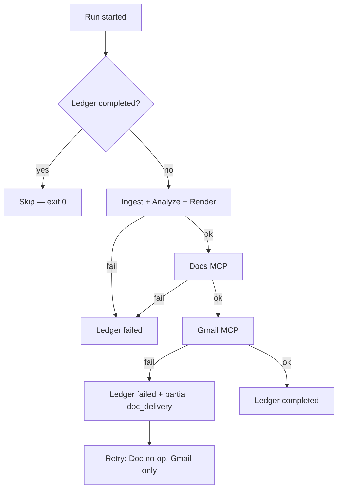

# Weekly Review Pulse — Edge Cases

Corner cases, failure modes, and fallback behavior for the **Groww Play Store review pulse**. Use this document during implementation, testing, and on-call review.

**Related:** [problemStatement.md](./problemStatement.md) · [architecture.md](./architecture.md) · [implementation-plan.md](./implementation-plan.md)

---

## Table of Contents

1. [How to Read This Document](#1-how-to-read-this-document)
2. [Ingestion & Normalization](#2-ingestion--normalization)
3. [Clustering Fallbacks](#3-clustering-fallbacks)
4. [PII Scrubbing](#4-pii-scrubbing)
5. [Embeddings](#5-embeddings)
6. [LLM Summarization (Groq)](#6-llm-summarization-groq)
7. [Quote Validation](#7-quote-validation)
8. [Report & Email Rendering](#8-report--email-rendering)
9. [Google Docs MCP](#9-google-docs-mcp)
10. [Gmail MCP](#10-gmail-mcp)
11. [Orchestrator, Ledger & Idempotency](#11-orchestrator-ledger--idempotency)
12. [Partial Failures & Retries](#12-partial-failures--retries)
13. [CLI, ISO Weeks & Scheduling](#13-cli-iso-weeks--scheduling)
14. [Security & Abuse](#14-security--abuse)
15. [Configuration & Environment](#15-configuration--environment)
16. [Operational & Concurrency](#16-operational--concurrency)
17. [Quick Reference Matrix](#17-quick-reference-matrix)
18. [Staging Observations (Phase 9)](#18-staging-observations-phase-9)

---

## 1. How to Read This Document

Each edge case uses:

| Column | Meaning |
|--------|---------|
| **Condition** | What went wrong or is unusual |
| **Expected behavior** | What the system should do |
| **Implementation note** | Where / how to handle it |

**Severity labels**

- **Abort** — fail the run; no Doc/email delivery
- **Degrade** — continue with reduced output
- **Skip** — no-op success (idempotent path)
- **Retry** — transient; retry with backoff

---

## 2. Ingestion & Normalization

### 2.1 Play Store scrape failures

| Condition | Expected behavior | Implementation note |
|-----------|-------------------|---------------------|
| HTTP 429 / rate limit from Play Store | **Retry** with exponential backoff (max 3); then **Abort** | `pulse/ingestion/play_store.py` |
| HTTP 5xx / timeout | **Retry** (max 3); then **Abort** | Same |
| HTTP 404 / app not found | **Abort** immediately; log invalid `app_id` | Verify `com.nextbillion.groww` in config |
| Empty scrape result (0 reviews) | **Abort**; ledger `failed` | No pipeline or delivery |
| Scrape interrupted mid-pagination | **Abort**; do not write complete cache | `manifest.json` status `error` if partial write |
| Play Store layout/HTML change breaks parser | **Abort**; alert operator | Fixture tests catch in CI; live monitor in prod |

### 2.2 Review window & volume

| Condition | Expected behavior | Implementation note |
|-----------|-------------------|---------------------|
| `window_weeks` outside 8–12 range in config | Reject at config load or clamp with warning | `config/products/groww.yaml` validation |
| Reviews in window &lt; `min_reviews` (20) after normalization | **Abort** before embedding | Orchestrator + pipeline guard |
| Reviews in window ≥ `max_reviews` (5000) cap | Truncate to newest within window; log truncation | Pagination stop + manifest count |
| Very few reviews in window but many outside | Only in-window reviews count; may **Abort** if &lt; 20 | Filter on `published_at` |
| All reviews older than window | **Abort** | Check date filter logic |

### 2.3 Normalization filters

| Condition | Expected behavior | Implementation note |
|-----------|-------------------|---------------------|
| Review &lt; 8 words | Drop at normalization | `normalizer.py` |
| Review contains emoji | Drop at normalization | Unicode emoji detection |
| Non-English text (Hindi-only, etc.) | Drop when `allowed_language: en` | Language detector or heuristic; false positives possible |
| English review with Hinglish words | **Keep** — common for Groww | Do not over-filter |
| Duplicate `(text, rating, published_at)` | Dedupe before normalization | Hash-based dedupe |
| Identical text, different ratings | **Keep both** — different hash | Intentional |
| Whitespace-only or punctuation-only | Drop | Trim + empty check |
| Very long review (&gt;10K chars) | Keep in raw; truncate at `max_review_chars` for LLM only | Scrubber / summarizer |

### 2.4 Cache behavior

| Condition | Expected behavior | Implementation note |
|-----------|-------------------|---------------------|
| Cache hit for same product + date | Skip live scrape unless `--force-refresh` | `cache.py` |
| Cache corrupt / invalid JSON | **Abort** or re-scrape with warning | Validate on read |
| Disk full during cache write | **Abort**; log I/O error | `data/cache/` permissions |
| Stale cache used after failed retry | Manifest must record `scrape_failed_at` | Do not serve partial as success |

---

## 3. Clustering Fallbacks

Primary path: UMAP (`random_state=42`) → HDBSCAN (`min_cluster_size=5`) → rank by `size × (6 − avg_rating)`.

### 3.1 Cluster count edge cases

| Condition | Expected behavior | Implementation note |
|-----------|-------------------|---------------------|
| **All noise** (every label = −1) | 1. Lower `min_cluster_size` by 2 (min 3), re-run HDBSCAN **once** | `clustering.py` fallback A |
| Still all noise after retry | **Degrade:** single rating-stratified LLM pass (1–2★ vs 4–5★ buckets) OR **Abort** if config `require_clusters: true` | Fallback B; log which path taken |
| **One cluster &gt;80%** of reviews | **Degrade:** optional rating split (1–2★ vs 4–5★) within mega-cluster, re-rank sub-groups | Fallback C |
| **Many micro-clusters** (dozens of size 5–6) | Take top `max_themes` by score only; ignore rest | No merge step in v1 |
| **Zero clusters** (HDBSCAN error) | **Abort** | Rare; log UMAP/HDBSCAN exception |
| Only 1–2 non-noise clusters | Summarize all that exist; report may have 1–2 themes | **Degrade** — valid output |
| Noise volume &gt; threshold (e.g. 40% of reviews) | Optionally add “Miscellaneous feedback” theme from noise sample | Config `noise_theme_threshold` |

### 3.2 Ranking edge cases

| Condition | Expected behavior | Implementation note |
|-----------|-------------------|---------------------|
| Tie scores between clusters | Break tie by larger cluster size, then lower avg rating | Deterministic sort |
| All clusters are 5★ praise | Still summarize; ranking favors larger groups | `6 − avg_rating` → low scores but valid |
| Cluster avg rating is exactly 3.0 | Score uses float avg; no special case | — |
| Top cluster is spam-like (“good app” × 50) | LLM may produce weak theme; quotes still validated | Consider min cluster text diversity later |

### 3.3 Sample selection edge cases

| Condition | Expected behavior | Implementation note |
|-----------|-------------------|---------------------|
| Cluster size &lt; `max_samples_per_cluster` | Use all members | No padding |
| Cluster size = 1 | Still send 1 sample to Groq if cluster ranked in top N | Rare after `min_cluster_size=5` |
| Medoid selection fails (identical embeddings) | Random sample among ties | Deterministic with `random_state` |

---

## 4. PII Scrubbing

| Condition | Expected behavior | Implementation note |
|-----------|-------------------|---------------------|
| Email in review | Redact → `[EMAIL]` | Before embed + LLM + publish |
| Indian mobile (+91, 10-digit) | Redact → `[PHONE]` | Multiple regex patterns |
| PAN-like / Aadhaar-like long numeric | Redact → `[ID]` | Avoid over-matching short numbers |
| URL with auth token in query | Redact path/query; keep domain if safe | `scrubber.py` |
| Financial amount (“₹10,000”, “2 lakhs”) | **Keep in v1** | Useful for theme signal |
| PII scrub changes quote text | Validator compares against **scrubbed** corpus | Critical for quote match |
| Review is only PII (e.g. phone number only) | May become `[PHONE]` only; may fail min_words earlier | Normalization runs first |
| Nested / obfuscated email (`user [at] mail dot com`) | May miss in v1; log for pattern expansion | Future regex |
| Scrubber throws on malformed Unicode | **Degrade:** skip review with warning OR replace invalid chars | `errors=replace` |

---

## 5. Embeddings

| Condition | Expected behavior | Implementation note |
|-----------|-------------------|---------------------|
| OpenAI API 429 / 5xx | **Retry** with backoff (max 3); then **Abort** | `embeddings.py` |
| OpenAI auth invalid | **Abort** fast | No retry |
| Single review exceeds model token limit | Truncate to `max_review_chars` before embed | Log truncation |
| Batch partially fails | Retry failed items only | Batch API handling |
| Cache hit for `sha256(scrubbed_text + rating)` | Skip API call | Disk cache under `data/` |
| Model version changed in config | Cache key should include model id | Invalidate stale cache |
| All embeddings identical (degenerate input) | UMAP/HDBSCAN may fail → see §3 | Log warning |

---

## 6. LLM Summarization (Groq)

### 6.1 API limits & errors

| Condition | Expected behavior | Implementation note |
|-----------|-------------------|---------------------|
| Groq 429 (RPM) | **Retry** with exponential backoff (max 3); respect `request_interval_seconds` | Sequential calls only |
| Groq 529 / overloaded | **Retry** (max 3) | Same |
| Groq daily RPD / TPD exceeded | **Abort** remaining themes; fail run if zero themes | Log headroom at start |
| Pre-flight estimate &gt; 10K tokens per request | Drop longest samples until under budget | Before each cluster call |
| `max_tokens_per_run` exceeded mid-run | Stop after current cluster; **Degrade** if ≥1 valid theme else **Abort** | Running token tally |
| Invalid JSON from Groq | **Retry** parse once with stricter prompt; then skip cluster | Schema validation |
| Empty `theme_name` or `quotes[]` | Re-prompt once; omit theme if still empty | — |

### 6.2 Prompt & content edge cases

| Condition | Expected behavior | Implementation note |
|-----------|-------------------|---------------------|
| Review contains “ignore previous instructions” | System prompt: treat as data; no tool execution | Untrusted framing |
| Review contains fake JSON / XML | Wrapped in delimiters; model outputs schema only | — |
| All samples in cluster are near-duplicate | LLM may repeat; quotes still validated | — |
| Cluster is profanity-heavy | Summarize professionally; do not censor quotes unless policy added | v1: keep verbatim validated quotes |
| Groq returns valid JSON but hallucinated quotes | Quote validator drops them → re-prompt or omit | §7 |

### 6.3 Theme output edge cases

| Condition | Expected behavior | Implementation note |
|-----------|-------------------|---------------------|
| All themes omitted after validation | **Abort** — no empty report to stakeholders | Min 1 theme required |
| Only 1 theme survives | **Degrade** — publish 1-theme report | Valid for v1 |
| `action_ideas` empty but theme valid | **Degrade** — publish theme without actions | Log warning |
| Duplicate theme names across clusters | Allow in v1; dedupe optional | Cosmetic issue |

---

## 7. Quote Validation

Validator rules: normalize whitespace → case-insensitive substring → ellipsis prefix match → cluster corpus first, full scrubbed corpus as fallback.

### 7.1 Match outcomes

| Condition | Expected behavior | Implementation note |
|-----------|-------------------|---------------------|
| Exact match after normalization | **Accept** | Baseline |
| Case mismatch (`Freezes` vs `freezes`) | **Accept** | Case-insensitive |
| LLM adds/removes surrounding quotes | Strip `"` `'` before match | Preprocess quote |
| LLM uses `...` mid-quote (truncation) | **Accept** if prefix matches start of review substring | Prefix match rule |
| LLM uses Unicode ellipsis `…` | Same as `...` | Normalize ellipsis |
| LLM fixes typo in quote | **Reject** — not verbatim | By design |
| Quote from different cluster’s review | **Reject** unless found in full corpus fallback | Prefer same-cluster |
| Quote match only after PII scrub (`[EMAIL]` in text) | **Accept** if scrubbed forms align | Scrub before validate |
| Quote is entire short review | **Accept** if substring | — |
| Quote spans two reviews (concatenation) | **Reject** | No multi-review merge |
| HTML entities in quote (`&amp;`) | Normalize entities before match | Renderer vs validator |

### 7.2 Re-prompt and omission

| Condition | Expected behavior | Implementation note |
|-----------|-------------------|---------------------|
| All quotes in theme fail validation | **Re-prompt** Groq once for that cluster | Counts toward RPM |
| Re-prompt still fails | **Omit theme**; log `quote_validation_failed` | — |
| Some quotes pass, some fail | Publish passing quotes only | **Degrade** |
| Theme omitted → fewer than 1 theme total | **Abort** run | See §6.3 |

---

## 8. Report & Email Rendering

| Condition | Expected behavior | Implementation note |
|-----------|-------------------|---------------------|
| `iso_week` invalid format (`2026-W99`) | **Abort** at CLI parse | ISO 8601 validation |
| Special chars in theme text (`<`, `&`) | Escape in HTML email; Docs blocks are structured | `email_teaser.py` |
| Very long theme name | Truncate in email teaser only; full in Doc | Config max lengths |
| Zero action ideas across report | Omit “Action ideas” H2 or show “None identified” | Template choice |
| `deep_link` missing (dry-run) | Email CTA placeholder or omit CTA | `dry_run` mode |
| Doc block list empty | **Abort** before MCP call | Orchestrator guard |

---

## 9. Google Docs MCP

| Condition | Expected behavior | Implementation note |
|-----------|-------------------|---------------------|
| `find_section_by_anchor` → `found: true` | **Skip** append; return existing `heading_id`, `url` | Idempotent |
| Anchor exists but heading manually deleted in Doc | `found: false` → append new section; **risk:** duplicate week content if ledger says completed | Manual ops: fix Doc or ledger |
| `document_id` invalid / no access | **Abort**; fail fast (no retry) | OAuth scope / sharing |
| OAuth token expired | Auto-refresh; **Abort** if refresh fails | MCP server auth |
| `batchUpdate` partial failure | **Abort**; do not record success | Transactional batch |
| Doc at Google size limit | **Abort**; alert operator | Rare for weekly append |
| Concurrent append from two runs (same week) | One wins; second `find_section_by_anchor` should find first | Run ledger + anchor |
| Deep link `heading_id` not linkable in email clients | Use full Google Docs URL format from API | `get_document_url` |
| Unicode in headings (Devanagari in quotes body) | Docs API supports UTF-8 | Test staging |

---

## 10. Gmail MCP

| Condition | Expected behavior | Implementation note |
|-----------|-------------------|---------------------|
| `check_idempotency` → `already_sent: true` | **Skip** send; return prior `message_id` | Idempotent |
| `idempotency_key` collision across products | Keys include `product` prefix — no collision | `groww-2026-W23-email` |
| `create_draft` vs `send_email` wrong mode | Respect `PULSE_EMAIL_MODE` and `--email-mode` | Staging default `draft` |
| Invalid recipient address | **Abort** Gmail step | Validate format in agent |
| Gmail API quota exceeded | **Retry** (max 3); then partial failure state | §12 |
| HTML email broken in client | Provide `text_body` fallback | Both required |
| Deep link in email blocked by client | Footer includes plain Doc URL | Redundant link |
| Draft created but operator never sends | Expected in staging; ledger records `draft_id` | Not an error |
| Send succeeds but idempotency ledger write fails | **Critical log**; retry send prevented by Gmail search? — rely on MCP ledger retry | §12 |

---

## 11. Orchestrator, Ledger & Idempotency

| Condition | Expected behavior | Implementation note |
|-----------|-------------------|---------------------|
| Ledger shows `completed` for `(groww, iso_week)` | **Skip** entire run; exit 0 | CLI + scheduler |
| Ledger shows `failed` for same week | **Retry** full pipeline (or Gmail-only if partial — see §12) | Operator backfill |
| Ledger shows `pending` (crashed mid-run) | Treat as incomplete; resume or overwrite `pending` | Stale `pending` timeout policy |
| Two processes run same week simultaneously | Unique constraint on `(product, iso_week)` completed; second should no-op or fail gracefully | SQLite locking |
| `run_id` UUID collision | Practically ignore; use `(product, iso_week)` as logical key | — |
| Completed run but Doc section manually removed | Ledger says completed; email link 404 — **operational** | `pulse status` + manual fix |
| Backfill overlapping weeks | Each week independent idempotency | Sequential backfill in CLI |

---

## 12. Partial Failures & Retries

| Failure point | Expected behavior | Ledger status | Retry strategy |
|---------------|-------------------|---------------|----------------|
| Ingestion fails | No Doc/email | `failed` | Full re-run |
| Pipeline/LLM fails | No Doc/email | `failed` | Full re-run |
| Doc append succeeds, Gmail fails | Doc exists | `failed` + partial delivery metadata | Re-run: Doc no-op, Gmail retried |
| Gmail succeeds, ledger write fails | Email sent | Log **critical** | MCP idempotency prevents duplicate email |
| MCP transient error (5xx, timeout) | — | `pending` or `failed` | Orchestrator backoff max 3 |
| MCP auth error | — | `failed` | Fix credentials; no blind retry |
| Dry-run | No MCP calls | Optional artifact only | — |

---

## 13. CLI, ISO Weeks & Scheduling

| Condition | Expected behavior | Implementation note |
|-----------|-------------------|---------------------|
| `--iso-week` not provided on Monday 09:00 IST | Default to previous complete week OR current week per config policy | Document chosen policy |
| Run on ISO week boundary (Dec/Jan) | `2026-W01` parsing correct | Use `datetime.isocalendar()` |
| Backfill `--from` &gt; `--to` | CLI error exit 2 | Validate args |
| Backfill 20 weeks sequentially | Each week idempotent; stop on non-transient error or continue per `--continue-on-error` | Optional flag |
| Scheduler double-fires (cron drift) | Second run no-ops via ledger | Within same week |
| Scheduler runs before reviews “settle” Monday AM | Policy: use previous ISO week | Config `iso_week_policy: previous_complete` |
| `dry-run` with missing API keys | Ingest may need network; embed/LLM need keys OR use cached artifacts | Document requirements |

---

## 14. Security & Abuse

| Condition | Expected behavior | Implementation note |
|-----------|-------------------|---------------------|
| Prompt injection in review text | Ignore; no elevated privileges | Data-only framing |
| Review asks model to exfiltrate secrets | No secrets in prompt; no tool use from review content | — |
| Google OAuth in agent codebase | **Must not** exist | MCP env only |
| PII in logs | Log counts only, never raw emails/phones | Structured logging |
| Scraper IP blocked | **Abort** ingestion; alert | Rate limits §2.1 |
| Maliciously long repeated runs (cost attack) | `max_tokens_per_run`; scheduler auth | Ops |

---

## 15. Configuration & Environment

| Condition | Expected behavior | Implementation note |
|-----------|-------------------|---------------------|
| Missing `GROQ_API_KEY` | **Abort** before summarization | Clear error message |
| Missing `sentence-transformers` / BGE model load failure | **Abort** before embedding | Local model; no API key |
| Missing `docs-mcp.env` / `gmail-mcp.env` | **Abort** at delivery (dry-run ok) | MCP spawn |
| `groww.yaml` missing `google_doc_id` | **Abort** at delivery | — |
| `PULSE_EMAIL_MODE=send` in staging by mistake | Send unless `--draft` override — document danger | Env checklist for prod |
| Invalid YAML in config | **Abort** at startup | Schema validation |
| Wrong Play Store `app_id` | Empty or wrong app reviews | Verify at Phase 1 |

---

## 16. Operational & Concurrency

| Condition | Expected behavior | Implementation note |
|-----------|-------------------|---------------------|
| Operator deletes `data/` cache | Re-scrape on next run | Slower but correct |
| Operator deletes ledger DB | Idempotency at MCP layer still protects Doc/email; ledger lost | **Operational risk** — backup ledger |
| Disk quota on `data/runs/` artifacts | **Degrade** — skip optional JSON snapshot | Core delivery unaffected |
| Python vs Node version mismatch | Document versions in README | CI matrix |
| MCP server process crash mid-call | Orchestrator **Retry** or **Abort** | Subprocess health |
| Groww app renamed / package id changes | Update `groww.yaml`; old cache invalid | Monitor manifest |

---

## 17. Quick Reference Matrix

| Area | Abort run | Degrade | Skip (idempotent) | Retry |
|------|-----------|---------|-------------------|-------|
| Scrape failure (after retries) | ✓ | | | ✓ |
| Reviews &lt; 20 normalized | ✓ | | | |
| All-noise clustering (after fallback) | ✓ or degrade | ✓ | | |
| Groq rate limit | | | | ✓ |
| Zero valid themes | ✓ | | | |
| Some quotes invalid | | ✓ | | |
| Doc anchor exists | | | ✓ | |
| Email idempotency hit | | | ✓ | |
| Doc ok, Gmail fail | | | | ✓ (Gmail only) |
| Ledger completed | | | ✓ | |
| MCP 5xx transient | | | | ✓ |

---

## 18. Staging Observations (Phase 9)

Recorded from staging E2E runs against Groww Play Store cache (June 2026).

### 18.1 Clustering fallback matrix (observed)

| Scenario | Fallback applied | `fallback_used` value | Outcome |
|----------|------------------|----------------------|---------|
| Normal diverse reviews (~884 normalized) | None | `null` | 5 themes ranked by `size × (6 − avg_rating)` |
| All HDBSCAN noise (first pass) | Lower `min_cluster_size` by 2 (min 3), re-run | `lowered_min_cluster_size` | Clusters recovered in most cases |
| Still all noise after retry | Rating-stratified synthetic clusters (1–2★ / 3★ / 4–5★) | `rating_stratified` | Degraded but valid themes |
| Single cluster &gt;80% of reviews | Split mega-cluster by low vs high rating | `rating_split_mega` | Separate complaint vs praise themes |

Implementation: `pulse/pipeline/clustering.py` — `_run_hdbscan_with_fallbacks`, `_rating_split_clusters`.

### 18.2 Quote validation (observed)

| Case | Behavior |
|------|----------|
| Quote matches review substring | Accepted |
| LLM paraphrase / typo | Re-prompt once; drop quote if still invalid |
| Ellipsis in quote (`...`) | Prefix/suffix match against source text |

### 18.3 Delivery idempotency (observed)

| Case | Behavior |
|------|----------|
| Re-run completed week | Ledger skip; exit 0 |
| Doc append then Gmail fail | Ledger `failed`; partial alert; retry skips Doc |
| Anchor `groww-2026-W24` already in ledger | MCP append skipped client-side |

### 18.4 Noise fraction (staging sample)

On the June 2026 Groww cache run (~884 reviews), HDBSCAN noise fraction was non-zero but below abort thresholds; top 5 clusters covered actionable complaint and praise themes. sklearn overflow warnings during medoid sampling were non-fatal.

---

## Document Maintenance

- Update this file when staging E2E surfaces new real-world cases (see [implementation-plan Phase 9](./implementation-plan.md#phase-9--production-readiness--scheduler)).
- Cross-link from [architecture.md §7.2](./architecture.md#72-embeddings-and-clustering) when clustering fallback behavior changes.
- Add test case IDs in `tests/` referencing section numbers (e.g. `test_quote_ellipsis_prefix` → §7.1).
