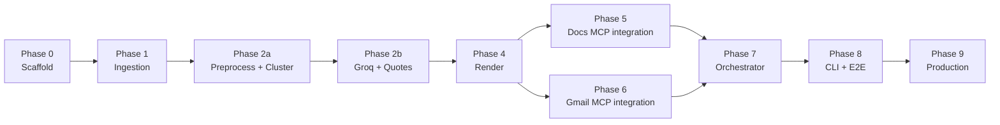

# Weekly Review Pulse — Implementation Plan

Phase-wise build plan for the **Groww Play Store review pulse**. Each phase has concrete tasks, deliverables, and **exit criteria** that must pass before the next phase starts.

**Source documents:** [problemStatement.md](./problemStatement.md) · [architecture.md](./architecture.md)

---

## Table of Contents

1. [Overview](#1-overview)
2. [Prerequisites](#2-prerequisites)
3. [Phase Map](#3-phase-map)
4. [Phase 0 — Repository & Configuration Scaffold](#phase-0--repository--configuration-scaffold)
5. [Phase 1 — Play Store Ingestion](#phase-1--play-store-ingestion)
6. [Phase 2a — Preprocessing & Clustering](#phase-2a--preprocessing--clustering)
7. [Phase 2b — LLM Summarization & Quote Validation (Groq)](#phase-2b--llm-summarization--quote-validation-groq)
8. [Phase 4 — Report & Email Rendering](#phase-4--report--email-rendering)
9. [Phase 5 — Google Docs MCP Integration](#phase-5--google-docs-mcp-integration)
10. [Phase 6 — Gmail MCP Integration](#phase-6--gmail-mcp-integration)
11. [Phase 7 — Orchestrator, Ledger & Idempotency](#phase-7--orchestrator-ledger--idempotency)
12. [Phase 8 — CLI, Integration & Staging E2E](#phase-8--cli-integration--staging-e2e)
13. [Phase 9 — Production Readiness & Scheduler](#phase-9--production-readiness--scheduler)
14. [Milestone Checklist](#milestone-checklist)
15. [Risks and Mitigations](#risks-and-mitigations)
16. [Related Documents](#related-documents)

---

## 1. Overview

### What we are building

A batch pipeline that:

1. Scrapes and normalizes Groww Google Play reviews (8–12 week window).
2. Clusters feedback (UMAP + HDBSCAN), summarizes themes with Groq, validates quotes.
3. Renders a one-page report and email teaser.
4. Delivers via the hosted **Google MCP Server** on Railway ([`web-production-bf583.up.railway.app`](https://web-production-bf583.up.railway.app/)).
5. Records every run in a SQLite ledger for audit and idempotency.

### v1 scope (locked)

| In scope | Out of scope |
|----------|--------------|
| Groww (`com.nextbillion.groww`) | Other fintech products |
| Google Play reviews | Apple App Store |
| Docs append + Gmail draft/send | BI dashboard, social sources |
| Weekly batch + CLI backfill | Real-time streaming |

### Implementation principles

- **Bottom-up:** ingestion and analysis work in isolation before MCP delivery.
- **Dry-run first:** full pipeline runnable without Google writes before Phase 8 E2E.
- **Idempotency from day one:** design anchors and keys in Phase 4–7, not as an afterthought.
- **Test fixtures over live APIs** in unit tests; one manual staging E2E before production.

---

## 2. Prerequisites

### Accounts and API keys

| Resource | Used by | Notes |
|----------|---------|-------|
| sentence-transformers (local) | `pulse/pipeline/embeddings.py` | `BAAI/bge-small-en-v1.5` |
| Groq API key | `pulse/pipeline/summarizer.py` | `llama-3.3-70b-versatile` |
| Hosted Google MCP Server | Docs + Gmail delivery (Phases 5–6) | [Railway deployment](https://web-production-bf583.up.railway.app/) — OAuth and Google API credentials live on the server |
| Google Doc (staging) | Docs append | Shared test document ID in `groww.yaml` |
| Google Doc (production) | Docs append | *Weekly Review Pulse — Groww* |
| Gmail sender account | Gmail draft/send | Configured on the hosted MCP server |

### Local tooling

- Python 3.11+ (pulse agent)
- `uv` or `poetry` for Python deps (pick one at Phase 0)
- SQLite (stdlib or via dependency)
- Network access to the hosted MCP server URL

### Hosted Google MCP Server (before Phase 5)

The Google Docs and Gmail MCP capabilities are provided by an **already-deployed** server:

- **URL:** [https://web-production-bf583.up.railway.app/](https://web-production-bf583.up.railway.app/)
- **Status:** `{"status":"ok","message":"Google MCP Server is running"}`
- **Ownership:** Google OAuth, token refresh, and API calls are handled on Railway — **not** in the pulse repo.
- **Pulse agent responsibility:** MCP client wiring in `pulse/agent/mcp_client.py`, tool discovery, and delivery orchestration (Phases 5–7).

Configure the agent with `MCP_SERVER_URL` (or `config/mcp/servers.json`) pointing at the Railway host. No local Node.js MCP build is required for delivery.

---

## 3. Phase Map



| Phase | Layer | Can parallelize with |
|-------|-------|----------------------|
| 0 | Foundation | — |
| 1 | Data retrieval | — |
| 2a | Preprocessing & clustering | — |
| 2b | LLM summarization (Groq) | — |
| 4 | Output generation | — |
| 5 | Delivery (Docs via hosted MCP) | Phase 6 |
| 6 | Delivery (Gmail via hosted MCP) | Phase 5 |
| 7 | Orchestration | — |
| 8 | Integration | — |
| 9 | Ops | — |

**Estimated duration (solo developer):** ~4–6 weeks. Phases 5 and 6 can overlap to save ~3–5 days.

---

## Phase 0 — Repository & Configuration Scaffold

**Goal:** Runnable repo skeleton, config loading, shared models, and test harness—no business logic yet.

### Tasks

| # | Task | Output |
|---|------|--------|
| 0.1 | Create directory layout per [architecture.md §4](./architecture.md#4-repository-layout-proposed) | `pulse/`, `mcp-servers/`, `config/`, `tests/`, `data/.gitkeep` |
| 0.2 | Add `.gitignore` (`data/`, `*.env`, `__pycache__`, `node_modules/`, `.venv`) | `.gitignore` |
| 0.3 | Python project setup (`pyproject.toml`, entry point `pulse`) | Installable package |
| 0.4 | Node workspace for `mcp-servers/*` | Root `package.json` workspaces |
| 0.5 | Implement `config/products/groww.yaml` and `config/pipeline.yaml` loaders | `pulse/config.py` |
| 0.6 | Define core models: `Review`, `RawReview`, `RunContext`, `PulseReport` | `pulse/ingestion/models.py`, extend as needed |
| 0.7 | Add env example files | `.env.example`, `config/mcp/*.env.example` |
| 0.8 | Pytest + fixture directory structure | `tests/conftest.py` |
| 0.9 | Structured JSON logging helper | `pulse/logging.py` |

### Deliverables

- `pulse run` stub that prints loaded config and exits 0.
- README section: how to install deps and run tests.

### Exit criteria

- [ ] `pytest` runs (even if only smoke tests).
- [ ] `groww.yaml` and `pipeline.yaml` load without error.
- [ ] `data/` is gitignored; example env files are committed.

---

## Phase 1 — Play Store Ingestion

**Goal:** Fetch Groww Play Store reviews, normalize, cache raw + normalized JSON.

**Architecture ref:** [§6 Play Store Ingestion](./architecture.md#6-play-store-ingestion)

### Tasks

| # | Task | Output |
|---|------|--------|
| 1.1 | Implement `play_store.py` scraper with pagination and date-window filter | Live fetch for `com.nextbillion.groww` |
| 1.2 | Rate limiting + exponential backoff on scrape errors | Retry policy |
| 1.3 | Implement `normalizer.py`: ≥8 words, English-only, no emoji | Filter pipeline |
| 1.4 | Deduplicate raw by `hash(text, rating, published_at)` | Dedupe step |
| 1.5 | Implement `cache.py`: write `reviews_raw.json`, `reviews_normalized.json`, `manifest.json` under `data/cache/{product}/{date}/` | Cache layer |
| 1.6 | Define `ReviewSource` protocol for future App Store adapter | `pulse/ingestion/sources.py` |
| 1.7 | Unit tests with fixture HTML/JSON snapshots (no live scrape in CI) | `tests/ingestion/` |
| 1.8 | CLI stub: `pulse ingest --product groww --weeks-back 10` | Manual verification command |

### Deliverables

- Cached pull for Groww with manifest showing raw vs normalized counts.
- Document observed ratios (~5,000 raw → ~800–900 normalized) in run notes.

### Exit criteria

- [ ] Live scrape returns ≥20 normalized reviews for a 10-week window.
- [ ] Cache hit on second run skips re-scrape (configurable force-refresh flag optional).
- [ ] Normalization rejects emoji-only and &lt;8-word reviews in fixture tests.
- [ ] Ingestion failure does not write partial cache without `manifest.json` error state.

---

## Phase 2a — Preprocessing & Clustering

**Goal:** PII-scrub, embed, and cluster normalized reviews into ranked theme candidates for Groq summarization.

**Architecture ref:** [§7.1–7.2](./architecture.md#71-pii-scrubbing)

**Input:** `reviews_normalized.json` — `{ text, rating }` only (see `data/cache/groww/2026-06-10/`).

### Groww cache research (baseline for tuning)

Measured on live 10-week Groww pull (`2026-06-10` cache):

| Signal | Observed value | Design implication |
|--------|----------------|-------------------|
| Normalized count | **884** reviews | Well above ML floor (20); ~32K embed tokens total |
| Rating skew | **52.5%** 1–2★ (402 + 62) | Ranking `size × (6 − avg_rating)` surfaces complaints — keep |
| Review length | median **18** words, max **104** words | Short-text embeddings are noisy; prefer top-N themes, not perfect separation |
| Lexical diversity | **875** unique 5-word prefixes / 884 | Expect **many micro-clusters + noise**; fallbacks are core path |
| Duplicates | 0 exact duplicate texts | Dedupe in Phase 1 is sufficient |
| PII in cache | 0 emails/phones/URLs pre-scrub | Scrubber still required before embed/LLM/publish |
| Romanized Hinglish | ~**9%** passed English filter | May weaken clusters/quotes; optional Phase 1 tighten later |
| Generic 5★ praise | ~**10%** | Deprioritized by ranking formula — correct for actionable pulse |

**Conclusion:** UMAP + HDBSCAN + complaint-biased ranking is the right approach. Implement **fallbacks as default behavior**, not edge cases. Cap themes at **`max_themes: 5`** to stay within Groq TPM (Phase 2b).

### Pipeline (2a only)

```
normalized {text, rating}
  → PII scrub
  → BAAI/bge-small-en-v1.5 local embed (scrubbed text; rating in cache key only)
  → UMAP (n_neighbors=15, n_components=5, random_state=42)
  → HDBSCAN (min_cluster_size=5, min_samples=3)
  → rank: score = size × (6 − avg_rating)
  → select top max_themes clusters
  → 5–8 samples per cluster (medoid + diversity)
  → hand off to Phase 2b
```

### Tasks

| # | Task | Output |
|---|------|--------|
| 2a.1 | Implement `scrubber.py`: email, phone, long numeric, URL tokens; **keep** financial amounts (₹, lakh, etc.) | PII redaction |
| 2a.2 | Table-driven scrubber tests | `tests/pipeline/test_scrubber.py` |
| 2a.3 | Implement `embeddings.py`: BGE-small local batch encode; disk cache `sha256(scrubbed_text + rating)` | Embedding module |
| 2a.4 | Implement `clustering.py`: UMAP + HDBSCAN with config defaults above | Cluster labels |
| 2a.5 | Cluster ranking + select top `max_themes` (default **5**) | Ranked clusters |
| 2a.6 | Sample selection: 5–8 reviews per cluster (medoid + diversity); truncate to `max_review_chars` | `select_cluster_samples()` |
| 2a.7 | ML floor: abort if normalized count &lt; 20 | Guard at pipeline entry |
| 2a.8 | Clustering fallbacks per [edge-cases.md §3](./edge-cases.md#3-clustering-fallbacks): lower `min_cluster_size` once; optional 1–2★ vs 4–5★ split if one cluster &gt;80% | Fallback module |
| 2a.9 | Golden-file + Groww-cache integration test: print top cluster sizes, avg ratings, sample texts | `tests/pipeline/test_clustering.py` |

### Deliverables

- Cluster report from cached Groww data: cluster count, noise %, top-5 ranked clusters with sizes and avg ratings.

### Exit criteria

- [ ] Scrubber redacts synthetic PII in all fixture cases.
- [ ] Embeddings cache prevents re-call on identical `text+rating`.
- [ ] On full Groww cache (~884 reviews): ≥2 usable ranked clusters **or** documented fallback path exercised (see edge-cases.md).
- [ ] Pipeline aborts cleanly when review count &lt; 20.
- [ ] Selected cluster count ≤ `max_themes` (5) before Groq handoff.

---

## Phase 2b — LLM Summarization & Quote Validation (Groq)

**Goal:** One Groq call per top cluster → theme name, summary, quotes, action ideas; quotes validated against scrubbed source text.

**Architecture ref:** [§7.3–7.4](./architecture.md#73-llm-summarization-groq)

**Provider:** [Groq](https://groq.com/) — model **`llama-3.3-70b-versatile`** (`GROQ_API_KEY`). Embeddings use local **BGE-small** (Phase 2a only).

### Groq rate limits (`llama-3.3-70b-versatile`)

| Limit | Quota | Pipeline constraint |
|-------|-------|---------------------|
| **Requests per minute (RPM)** | 30 | Sequential calls only; `request_interval_seconds: 2` (≤30 req/min) |
| **Requests per day (RPD)** | 1,000 | Weekly run ≈ 5–10 req → ~100 runs/day headroom |
| **Tokens per minute (TPM)** | 12,000 | **Hard cap** `max_tokens_per_run: 12000`; pre-flight each request &lt;10K tokens |
| **Tokens per day (TPD)** | 100,000 | Weekly run ≈ 6–8K tokens → ~12 full runs/day headroom |

### Per-run Groq budget (Groww baseline)

| Resource | Typical run | Max allowed |
|----------|-------------|-------------|
| Cluster summarization calls | 5 (one per theme) | `max_themes: 5` |
| Quote-validation re-prompts | 0–5 (once per failed cluster) | Count toward RPM/RPD |
| **Total requests** | **≤10** | Must stay ≤30/min with 2s spacing |
| **Total tokens** | **~6–8K** (884-review cache) | Must stay ≤12K/run and ≤12K/min |

**Call pattern:** One Groq request per cluster — **no** parallel LLM calls. On 429/529: exponential backoff, max 3 retries.

### Pipeline (2b only)

```
ranked clusters + samples (from 2a)
  → pre-flight token estimate per cluster
  → Groq llama-3.3-70b-versatile (sequential, 2s gap)
  → JSON schema: theme_name, summary, quotes[], action_ideas[]
  → quote_validator (substring match on scrubbed text)
  → re-prompt once if all quotes fail (counts toward limits)
  → PulseReport
```

### Tasks

| # | Task | Output |
|---|------|--------|
| 2b.1 | Implement `summarizer.py` with Groq client + strict JSON schema per theme | Theme objects |
| 2b.2 | Untrusted-data prompt framing; ignore instructions embedded in reviews | Prompt templates |
| 2b.3 | Enforce sequential calls + `request_interval_seconds: 2` | RPM compliance |
| 2b.4 | Pre-flight token estimate; drop longest samples first if over per-request budget | TPM guard |
| 2b.5 | Run-level token tally; abort if `max_tokens_per_run` (12,000) exceeded | TPD/TPM safety |
| 2b.6 | 429/529 retry with exponential backoff (max 3) | Resilience |
| 2b.7 | Re-prompt **once** per cluster when all quotes fail validation | Retry logic |
| 2b.8 | Implement `quote_validator.py`: whitespace normalize, case-insensitive substring, ellipsis prefix | Validator |
| 2b.9 | Table-driven validator tests + mock Groq rate-limit tests | `tests/pipeline/` |
| 2b.10 | Assemble `PulseReport`; log requests, input/output tokens, headroom vs Groq caps | `pulse/models/report.py` |

### Deliverables

- `PulseReport` JSON at `data/runs/{run_id}/report.json` on dry analysis run.
- Run log line: `groq_requests`, `groq_tokens_in`, `groq_tokens_out`, `groq_rpm_headroom`, `groq_tpm_headroom`.

### Exit criteria

- [ ] Full analysis on Groww cache (~**884** reviews) completes in **≤10 Groq requests** and **≤12,000 tokens**.
- [ ] No parallel Groq calls; ≥2s between requests.
- [ ] Every published quote passes substring validation against scrubbed cluster text.
- [ ] Hallucinated quotes from mock LLM are dropped in tests.
- [ ] Run logs include Groq request count, token usage, and headroom vs RPM/TPM/RPD/TPD.

---

## Phase 4 — Report & Email Rendering

**Goal:** Pure functions that turn `PulseReport` into Docs blocks and email teaser payloads.

**Architecture ref:** [§8 Output Generation](./architecture.md#8-output-generation)

### Tasks

| # | Task | Output |
|---|------|--------|
| 4.1 | Implement `doc_section.py`: plain-text section content for append-only Docs MCP | `DocSection` |
| 4.2 | Section anchor: `groww-{iso_week}` embedded in heading / metadata | Anchor convention |
| 4.3 | Implement `email_teaser.py`: subject, HTML + plain text, CTA placeholder for `deep_link` | `EmailTeaser` |
| 4.4 | “Who this helps” static section (Product / Support / Leadership) | Template content |
| 4.5 | Snapshot tests for rendered output against golden files | `tests/render/` |
| 4.6 | Wire analysis → render in a `pulse analyze --product groww` dev command | Local preview |

### Deliverables

- Printed Doc block tree and email HTML for a sample `PulseReport` (no Google APIs).

### Exit criteria

- [ ] Doc section is plain text (`content` field) suitable for append-only Docs MCP.
- [ ] Section includes anchor line (`Anchor: groww-2026-W23`) for idempotency lookup.
- [ ] Email body contains theme bullets only—no full report duplicate.
- [ ] Anchor key `groww-2026-W23` is deterministic from product + iso_week.
- [ ] Renderer is pure (no I/O, no Google imports).

---

## Phase 5 — Google Docs MCP Integration

**Goal:** Wire the pulse agent to the **hosted Google MCP Server** for idempotent Doc section appends.

**Architecture ref:** [§9](./architecture.md#9-mcp-server-architecture)

**MCP endpoint:** [https://web-production-bf583.up.railway.app/](https://web-production-bf583.up.railway.app/)

**Can start after Phase 4** (needs `DocSection.content` plain text); parallel with Phase 6.

> **Note:** We do **not** build or deploy a local `mcp-servers/google-docs-mcp` for v1. The Railway server already encapsulates Google Docs API access. Phase 5 is **client integration + verification** only.

> **Server repo:** [chitragohad/Chitra-MCP-server](https://github.com/chitragohad/Chitra-MCP-server) — FastAPI with `POST /append_to_doc` and `POST /create_email_draft`. Production requires `X-Approval-Key` header (`MCP_APPROVAL_KEY`).

### Tasks

| # | Task | Output |
|---|------|--------|
| 5.1 | Add `MCP_SERVER_URL` and `MCP_APPROVAL_KEY` to agent config / `.env.example`; update `config/mcp/servers.json` | Remote MCP config |
| 5.2 | Implement `pulse/agent/mcp_client.py`: HTTP client for `/append_to_doc` with approval header | MCP client |
| 5.3 | Client-side `find_section_by_anchor` via local anchor ledger (`data/deliveries/doc_anchors.json`) | Idempotency pre-check |
| 5.4 | `append_section(document_id, DocSection.content)` → `POST /append_to_doc` | Append call |
| 5.5 | `get_document_url(document_id)` → `https://docs.google.com/document/d/{id}/edit` | Deep link for email |
| 5.6 | `pulse deliver-doc --run-dir ... --doc-id ...` CLI for staging | Manual delivery |
| 5.7 | Unit tests with mocked HTTP | `tests/agent/test_mcp_client_docs.py` |
| 5.8 | Manual staging test: append one weekly section to staging Doc | Verified section + anchor |

### Deliverables

- Pulse agent calls `POST /append_to_doc` on [Railway MCP](https://web-production-bf583.up.railway.app/).
- Staging Doc with one appended plain-text section; duplicate runs skip via anchor ledger.

### Exit criteria

- [ ] Second `deliver-doc` for same anchor skips append (`skipped_duplicate: true`).
- [ ] `append_section` sends `DocSection.content` as plain text.
- [ ] Google OAuth credentials never appear in pulse agent code or logs (server-side only).
- [ ] `get_document_url` produces a valid Docs edit link for email CTA (Phase 6).

---

## Phase 6 — Gmail MCP Integration

**Goal:** Wire the pulse agent to the **same hosted Google MCP Server** for draft/send with idempotency keys.

**Architecture ref:** [§9](./architecture.md#9-mcp-server-architecture)

**MCP endpoint:** [https://web-production-bf583.up.railway.app/](https://web-production-bf583.up.railway.app/)

**Parallel with Phase 5** (same server, different tools).

> **Note:** We do **not** build or deploy a local `mcp-servers/gmail-mcp` for v1. Idempotency and Gmail API access are provided by the hosted server.

> **Server repo:** [chitragohad/Chitra-MCP-server](https://github.com/chitragohad/Chitra-MCP-server) — `POST /create_email_draft` with `{ to, subject, body }`. Plain-text body only (MCP creates `MIMEText` draft). No `send_email` endpoint yet.

### Tasks

| # | Task | Output |
|---|------|--------|
| 6.1 | Extend `mcp_client.py` with `create_email_draft` | Shared MCP client |
| 6.2 | Client-side `check_idempotency` via `data/deliveries/email_idempotency.json` | Duplicate detection |
| 6.3 | `create_email_draft` → `POST /create_email_draft` with `EmailTeaser.text_body` | Staging default |
| 6.4 | `mode=send` rejected until MCP server adds send endpoint | Documented guard |
| 6.5 | Re-render teaser with Doc URL from Phase 5 anchor ledger | Linked CTA |
| 6.6 | Record `draft_id` / `message_id` in email idempotency ledger | Audit trail |
| 6.7 | `pulse deliver-email --run-dir ... --to ...` CLI | Manual delivery |
| 6.8 | Unit tests with mocked HTTP | `tests/agent/test_mcp_client_gmail.py` |

### Deliverables

- Gmail draft creation via [Railway MCP](https://web-production-bf583.up.railway.app/) with Doc link in body.
- One staging draft with “Read full report” pointing at appended Doc section.

### Exit criteria

- [ ] Second `deliver-email` for same idempotency key skips (`skipped_duplicate: true`).
- [ ] Default path is `mode=draft`.
- [ ] Email body includes Doc URL when Phase 5 anchor ledger exists.
- [ ] No Gmail OAuth secrets in the pulse repo.

---

## Phase 7 — Orchestrator, Ledger & Idempotency

**Goal:** End-to-end coordinator wiring ingestion → analysis → render → MCP delivery with run ledger.

**Architecture ref:** [§5](./architecture.md#5-end-to-end-run-flow), [§10](./architecture.md#10-run-ledger-and-audit)

### Tasks

| # | Task | Output |
|---|------|--------|
| 7.1 | Implement `mcp_client.py`: connect to hosted MCP (`MCP_SERVER_URL`), tool discovery, call wrapper | MCP host |
| 7.2 | Implement `ledger/store.py` SQLite: `runs` + `deliveries` tables | Run ledger |
| 7.3 | Unique constraint `(product, iso_week)` where `status=completed` | DB migration |
| 7.4 | Implement `orchestrator.py` run lifecycle per sequence diagram | Coordinator |
| 7.5 | Idempotency check at start: skip if ledger shows `completed` | No-op path |
| 7.6 | Delivery order: `find_section_by_anchor` → `append_section` → `check_idempotency` → `create_draft`/`send_email` | MCP call chain |
| 7.7 | Partial failure handling: Doc ok + Gmail fail → ledger `failed` with partial delivery metadata | Retry-safe state |
| 7.8 | MCP transient error retry (backoff, max 3) | Resilience |
| 7.9 | Write audit JSON matching architecture run output schema | `data/runs/{run_id}/` |
| 7.10 | Integration test: full run with mocked MCP + real ledger | `tests/integration/` |

### Deliverables

- `orchestrator.run(product, iso_week, dry_run=False)` callable from tests and CLI.

### Exit criteria

- [ ] Re-run same `iso_week` exits 0 with no duplicate Doc section or email (ledger + MCP checks).
- [ ] Failed ingestion/pipeline leaves ledger `failed` with no Doc/email writes.
- [ ] Partial failure (Doc ok, Gmail fail) allows Gmail-only retry.
- [ ] `pulse status --product groww --iso-week YYYY-Www` shows delivery ids.

---

## Phase 8 — CLI, Integration & Staging E2E

**Goal:** Production-shaped CLI, dry-run mode, and one full staging run against real Google APIs.

**Architecture ref:** [§12](./architecture.md#12-cli-and-scheduling), [§17](./architecture.md#17-testing-strategy)

### Tasks

| # | Task | Output |
|---|------|--------|
| 8.1 | Implement `cli.py` commands: `run`, `backfill`, `dry-run`, `status`, `ingest` | Full CLI |
| 8.2 | `dry-run`: full pipeline, write `report.json`, skip MCP writes | Safe dev path |
| 8.3 | `backfill`: sequential ISO weeks with idempotency between weeks | Historical runs |
| 8.4 | ISO week resolution: current week vs previous complete week (Monday IST policy) | Week logic |
| 8.5 | `--email-mode draft|send` and `PULSE_EMAIL_MODE` env override | Environment control |
| 8.6 | Structured JSON logs per stage (`run_id`, `product`, `iso_week`) | Observability |
| 8.7 | Optional metrics: duration per stage, token counts in log summary | Run summary |
| 8.8 | **Staging E2E (manual):** `pulse run --product groww` → staging Doc + draft email | Sign-off artifact |
| 8.9 | Document operator runbook in README | Ops docs |

### Deliverables

- Staging E2E run record: Doc section URL + Gmail draft id in ledger.
- Operator runbook: env setup, dry-run, staging run, status check.

### Exit criteria

- [ ] `pulse dry-run --product groww` completes without Google credentials.
- [ ] Staging E2E: Doc section readable, email draft has working deep link.
- [ ] `pulse backfill --from 2026-W20 --to 2026-W22` skips already-completed weeks.
- [ ] All CI unit + integration tests pass.

---

## Phase 9 — Production Readiness & Scheduler

**Goal:** Scheduled weekly runs, production config, monitoring, and stakeholder sign-off.

**Architecture ref:** [§16 Environments](./architecture.md#16-environments), [§13–15](./architecture.md#13-security-and-safety)

### Tasks

| # | Task | Output |
|---|------|--------|
| 9.1 | Create production Google Doc *Weekly Review Pulse — Groww*; update `groww.yaml` | Prod `google_doc_id` |
| 9.2 | Confirm production Gmail sender on hosted MCP; `default_mode: send` for scheduler | Prod email config |
| 9.3 | Scheduler: cron / GitHub Actions / Cloud Scheduler — Monday 09:00 IST | `.github/workflows/weekly-pulse.yml` or cron doc |
| 9.4 | Secrets injection: `GROQ_API_KEY` + `MCP_SERVER_URL` in scheduler; Google OAuth stays on Railway only | Secret layout |
| 9.5 | Alert on `failed` or `partial` ledger status (log-based or webhook—minimal v1) | Failure visibility |
| 9.6 | Draft `edge-cases.md` with clustering fallbacks and quote edge cases observed in staging | Ops reference |
| 9.7 | Stakeholder review of first production report | Sign-off |
| 9.8 | Enable production send only after explicit confirmation (not draft) | Go-live gate |

### Deliverables

- First scheduled production run with ledger `completed`.
- `edge-cases.md` stub with at least clustering fallback matrix.

### Exit criteria

- [ ] Scheduler fires weekly without manual intervention.
- [ ] Production email `mode=send` reaches stakeholder inboxes.
- [ ] Production Doc accumulates week-labeled sections with stable anchors.
- [ ] Operator can answer “what was sent for week X?” via `pulse status` or ledger SQL.
- [ ] Stakeholder sign-off on report quality (themes, quotes, actions).

---

## Milestone Checklist

Use this as a release gate summary across phases.

| Milestone | Phases | Definition of done |
|-----------|--------|-------------------|
| **M1 — Data in** | 0–1 | Cached Groww reviews, normalized, tested |
| **M2 — Insights out** | 2a–2b | `PulseReport` with validated themes and quotes |
| **M3 — Render ready** | 4 | Plain-text Doc section + email teaser from report |
| **M4 — MCP delivery** | 5–6 | Staging Doc append + Gmail draft via [Chitra MCP](https://github.com/chitragohad/Chitra-MCP-server) |
| **M5 — Full pipeline** | 7–8 | Idempotent end-to-end run, CLI complete |
| **M6 — Live pulse** | 9 | Weekly production schedule, stakeholder sign-off |

---

## Risks and Mitigations

| Risk | Phase | Mitigation |
|------|-------|------------|
| Play Store blocks scraper | 1 | Backoff, user-agent policy, cache aggressively |
| Groq RPM/TPM/RPD/TPD exceeded | 2b | Sequential calls, 2s interval, `max_tokens_per_run: 12000`, ≤10 req/run |
| High cluster noise (Groww diversity) | 2a | Fallbacks + top-5 by score; optional rating split |
| All-noise clustering | 2a | Lower `min_cluster_size` once; document in `edge-cases.md` |
| Google MCP auth / server down | 5–6 | Health check on Railway URL; alert on 5xx; retry with backoff |
| Hallucinated quotes | 2b | Substring validator + re-prompt once |
| Duplicate weekly email | 6–7 | Idempotency key + ledger + Docs anchor |
| problemStatement vs architecture on ingestion | 1 | **Follow architecture:** ingestion in `pulse/ingestion/`; update problemStatement when convenient |

---

## Related Documents

| Document | Purpose |
|----------|---------|
| [problemStatement.md](./problemStatement.md) | Product intent, requirements, non-goals |
| [architecture.md](./architecture.md) | Components, data flows, MCP contracts |
| `edge-cases.md` | Clustering fallbacks, quote validation edge cases (create in Phase 9) |

### Suggested next steps after Phase 0

1. Verify Groww `app_id` (`com.nextbillion.groww`) on Play Store.
2. Obtain Groq API key (embeddings run locally via BGE-small).
3. Start Phase 5–6 MCP **client integration** against [hosted Google MCP Server](https://web-production-bf583.up.railway.app/) once Phase 4 render output is stable.
